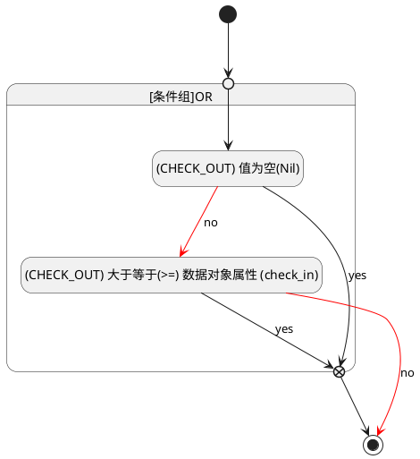

## 签离(CHECK_OUT) <!-- {docsify-ignore-all} -->

   

### 变更校验 :id=check_validity

#### 条件说明

##### (CHECK_OUT) 值为空(Nil) :id=abdf27f15e78545fe8a053b97f5461b13

`CHECK_OUT(签离)` ISNULL 

##### (CHECK_OUT) 大于等于(>=) 数据对象属性 (check_in) :id=abb448fe46b6ba07f620ae32f71f1c4a6

`CHECK_OUT(签离)` GTANDEQ  `check_in`

> [!ATTENTION|label:规则信息|icon:fa fa-warning]
> "签离"时间不能早于"签到"时间。

