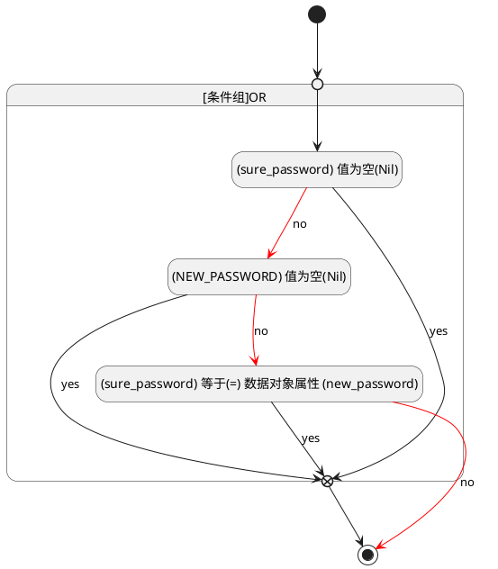

## 密码(PASSWORD) <!-- {docsify-ignore-all} -->

   

### 两次密码不一致 :id=PASSWORD

#### 条件说明

##### (sure_password) 值为空(Nil) :id=a3c7a01d16e56ad57b285833254cda6fe

`sure_password` ISNULL 

##### (NEW_PASSWORD) 值为空(Nil) :id=ae37ce88bc63f2e6fc023e02a60bdc3f8

`NEW_PASSWORD(设置密码)` ISNULL 

##### (sure_password) 等于(=) 数据对象属性 (new_password) :id=af3099081c22a4d0c9c4e8d4c4f874798

`sure_password` EQ  `new_password`

> [!ATTENTION|label:规则信息|icon:fa fa-warning]
> 两次输入的密码不一致

### 默认规则 :id=Default

```plantuml
@startuml
hide empty description
<style>
root {
  HyperlinkColor #42b983
}
</style>

state "start" as start  <<start>>
state "end" as end <<end>>
state "默认字符串长度" as 7f62d02afcd0b71dc37da2682a66f25b [[$./password#a7f62d02afcd0b71dc37da2682a66f25b {"默认字符串长度"}]]


start --> 7f62d02afcd0b71dc37da2682a66f25b 
7f62d02afcd0b71dc37da2682a66f25b --> end 


@enduml
```

#### 条件说明

##### 默认字符串长度 :id=a7f62d02afcd0b71dc37da2682a66f25b

*关键条件*

`PASSWORD(密码)` 属性长度在区间 `(0 , 500]` 内

> [!ATTENTION|label:规则信息|icon:fa fa-warning]
> 内容长度必须小于等于[500]

